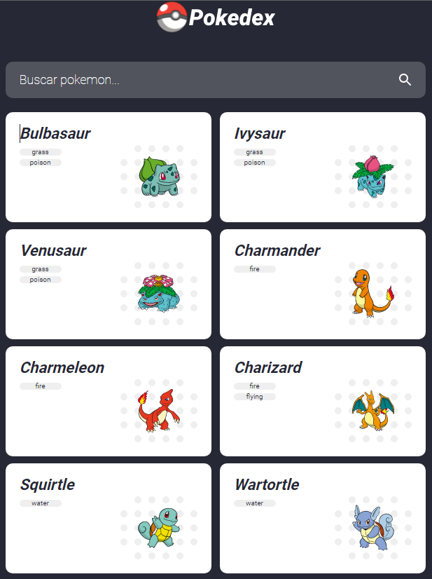
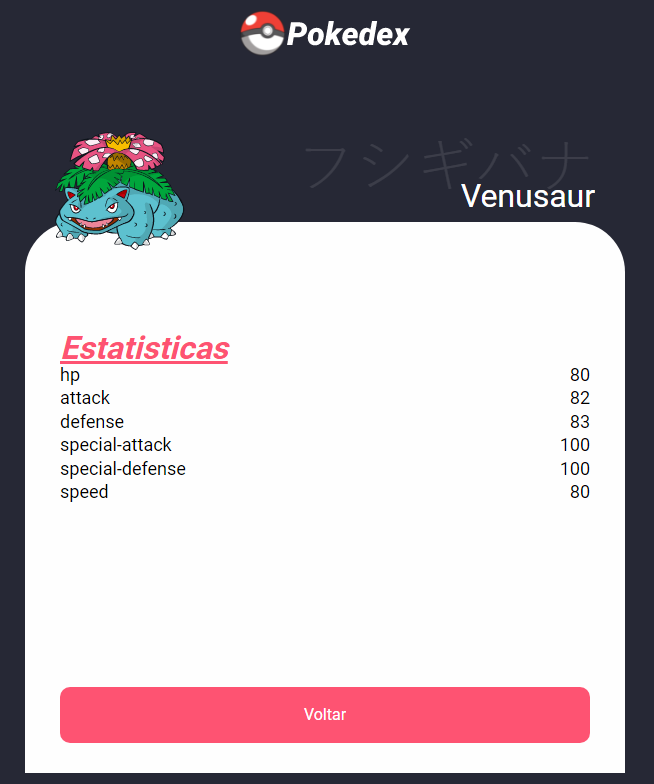
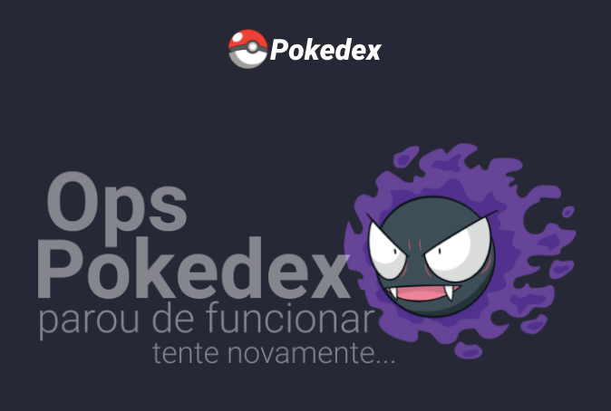

#  POKEDEX - POKEMON

Essa aplicação criada em `Angular: 14.2.12` e `typeScript` estamos consumindo a API Pokemon.

Onde ao clicar no pokemon, ele é carregado para uma página, onde mostra os detalhes do pokemon selecionado.

Também foi criado umas animações, pegando o código css no site 

Também usamos o `forkJoin` do `rxjs` do Angular.

O `forkJoin` do RxJS, acompanha o andamento das requisições (observables) passadas como parâmetro e emite um sinal quando todas as requisições forem finalizadas

ScreenShot - Quando Carrega página - Lista todos os 100 pokemon's.

ScreenShot - Erro na API tanto de listagem dos pokemon, ou no API que faz a consulta dos detalhes do pokemon.

<h1 align="center">💻 Desenvolvido Por: Gilberto Júnior</h1>